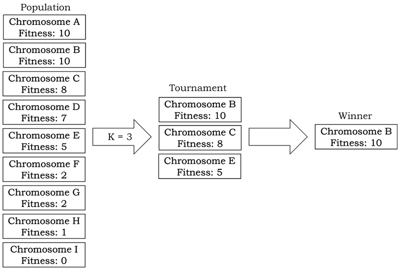
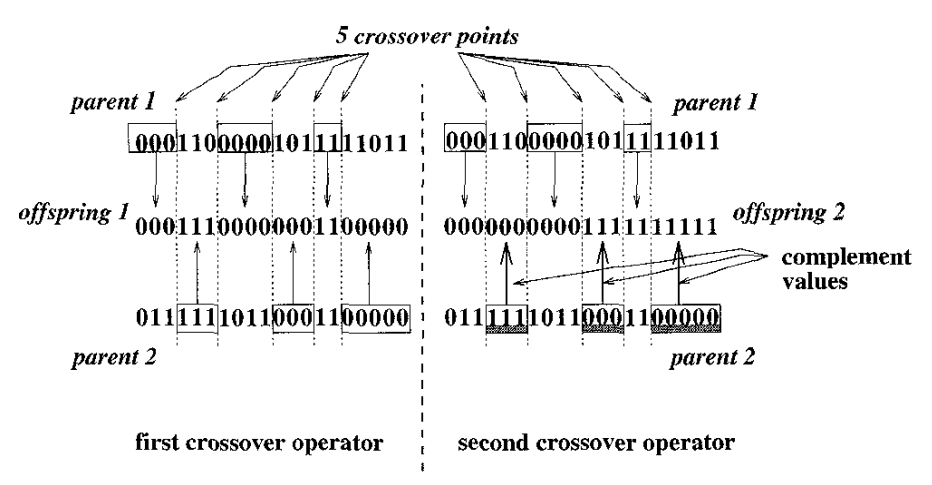
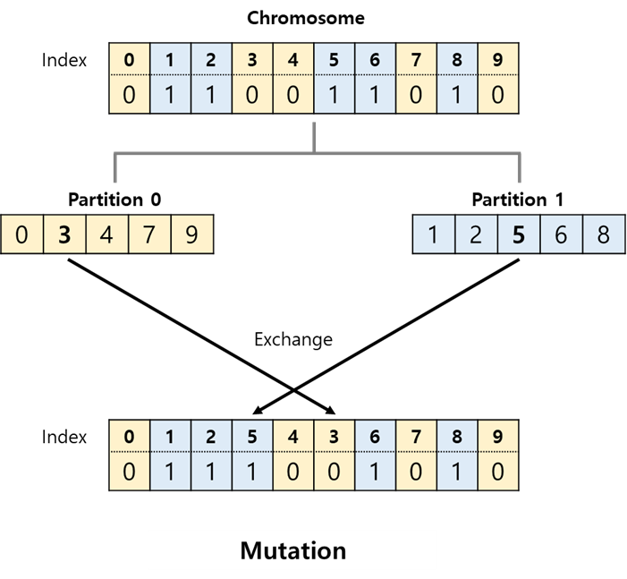
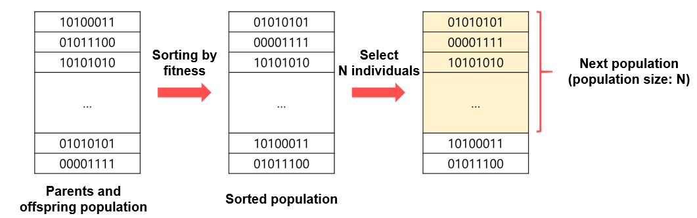

# Genetic Algorithm for Graph Partitioning

>> ## **1. What is Graph Partitioning?**
> 
>> ### **1.1 Problem Introduction**

Given an undirected graph $G = (V, E)$, where $V$ is a set of vertices with $n$ elements and $E$ is a set of edges connecting the vertices. The task is to divide the graph into two vertex sets $v1$ and $v2$ such that the number of edges connecting vertices from different sets is minimized and the sizes of the two sets are equal.


> ### **1.2 Purpose of Graph Partitioning**
>> Analyze a large-scale graph into smaller subproblems that can be solved independently and in parallel.

>> Faster processing speed. 

>
> ## **2. Design Decisions**
>> ### 2.1 Parameters
> The program design includes 5 parameters.
> 
> * **POP_SIZE**
>     * Initial population size.
>     * Type: INT
>     * Range: [1, INF)
>     
> * **NUM_NODES**
>     * Number of vertices in the randomly generated graph.
>     * It must be an **even number**.
>     * Type: INT
>     * Range: [2, INF)
>
> * **CONNECT_PROB**
>     * Probability of connecting two vertices with an edge.
>     * Type: FLOAT
>     * Range: [0., 1.)
>     
> * **MUT_PROB**
>     * Probability of mutation.
>     * Type: FLOAT
>     * Range: [0., 1.)
>     
> * **STOPPING_COUNT**
>     * Stopping criterion.
>     * If no improvement occurs within STOPPING_COUNT iterations, the program stops.
>     * Type: INT
>     * Range: (1, INF)
>
> * **K_IND**
>     * Number of individuals selected for tournament selection.
>     * Type: INT
>     * Range: [1, NUM_NODES)
> -----    
>> ### 2.2 Stopping Criteria
> * If no improvement occurs within 10 iterations, the program stops.
> * The number of iterations without improvement can be adjusted with the **STOPPING_COUNT** parameter.
> -----
>> ### 2.3 Fitness Function
> * The fitness value of each individual is calculated using the following equation:
> 

 $$F_i = \frac{(C_w – C_y) + (C_w – C_b)}{3}$$
> * Where:\
> $C_w$: Cut size of the worst solution in the population.\
> $C_b$: Cut size of the best solution in the population.\
> $C_y$: Cut size of solution $i$, i.e., the individual being evaluated.
> * Cut size is the number of edges between partitions. Smaller cut size indicates a better partition.
> * The fitness function guides the optimization algorithm to find better solutions. Individuals with higher fitness values are more likely to be selected for crossover and mutation, while those with lower fitness values are more likely to be eliminated. The ultimate goal is to find the individual with the best fitness value, representing the best graph partition according to the given criteria.

> 
> -----
>> ### 2.4 Selection Operator
> * **Tournament Selection**
>     * Randomly select $k$ individuals from the population and choose the best among them.
>     * The random number $k$ can be adjusted with the **K_IND** parameter.
>     



>     
> -----
>> ### 2.5 Crossover Operator
> * **Multi-point Crossover**
>   * From tournament selection, two chromosomes are selected as parents.
>   * 5 cut points are randomly chosen for crossover.
>   * Two offspring are created differently (as shown in the figure below).
>   * If the partitions of the new offspring are not equal in size, the offspring are discarded.



>
> * **Single-point Crossover**
>   * From tournament selection, two chromosomes are selected as parents.
>   * A random crossover point is chosen.
>   * If the partitions of the new offspring are not equal in size, the offspring are discarded.

>
> -----
>> ### 2.6 Mutation Operator
> * Replace a node in the graph with another suitable node.
> * A node randomly selected from partition 0 is swapped with a node randomly selected from partition 1.



>
> -----
>> ### Generational Selection Strategy
> * **Elitism**
>     * Keep the top M individuals from the parent generation to maintain overall population quality.



>     
> ## **3. Program Execution**
> ```
> cd src
> python3 main.py
> ```
>> ### Requirements
> ```
> networkx
> numpy
> ```
>> **Installation**
> ```
> pip3 install networkx
> pip3 install numpy
> ```
> ## **4. Adjusting Learning Parameters**
> Define parameters as global variables in `main.py`:
> ```
> POP_SIZE = 300 
> NUM_NODES = 100
> CONNECT_PROB = 0.1
> MUT_PROB = 0.3
> STOPPING_COUNT = 10
> K_IND = int(POP_SIZE * 0.1)
> ```
> You can adjust the parameters by modifying their values.
> 
> ## **5. References**
>> ### Genetic Algorithm and Graph Partitioning
>> (Paper link: https://ieeexplore.ieee.org/abstract/document/508322)
